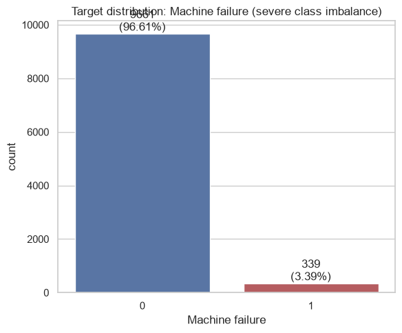
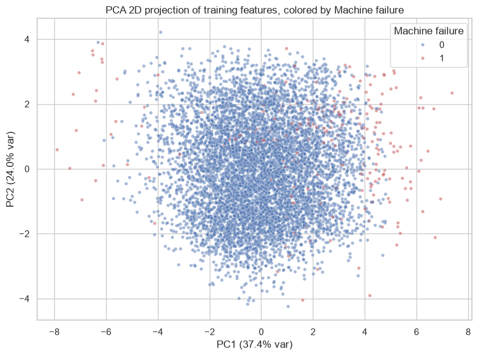
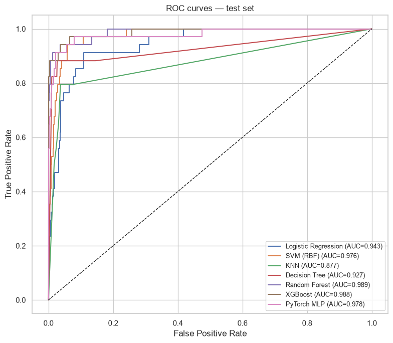
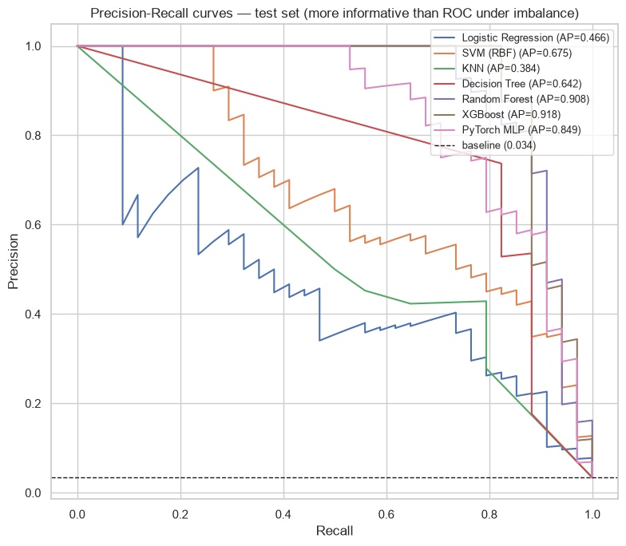
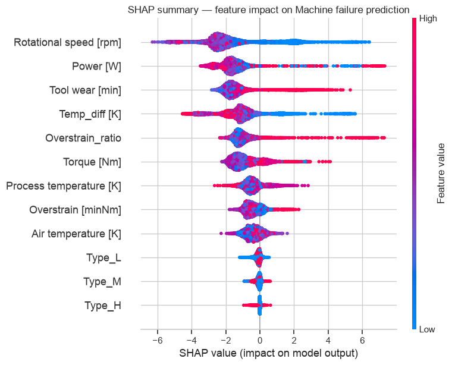
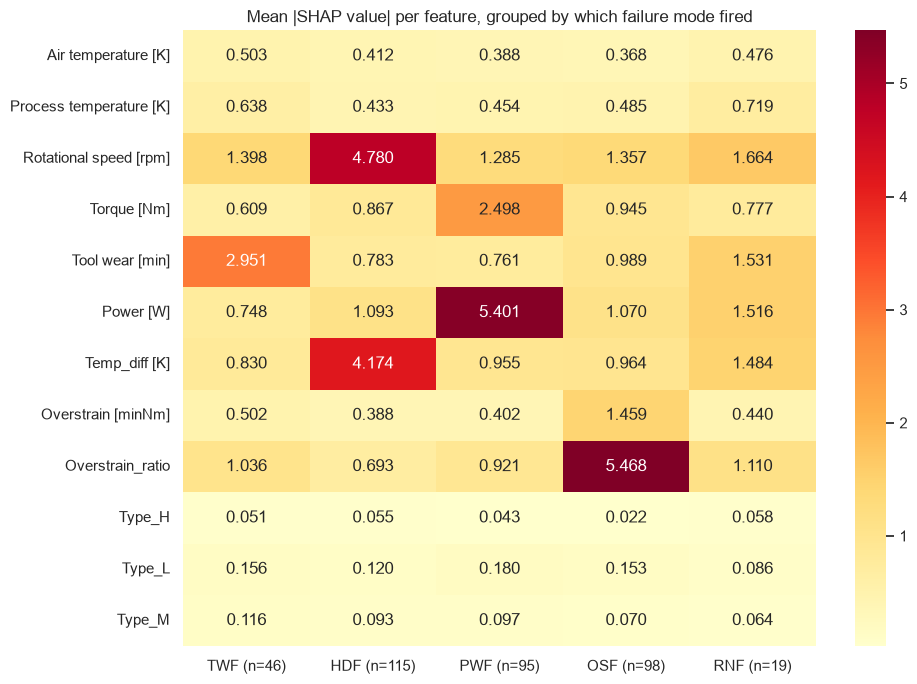

# Machine Failure Prediction


Predicts `Machine failure` on the AI4I 2020 predictive maintenance dataset, then uses SHAP to
verify the model is actually keying off the right physics for each of the five underlying failure
mechanisms instead of just fitting noise.

Dataset: [AI4I 2020 Predictive Maintenance](https://archive.ics.uci.edu/dataset/601/ai4i+2020+predictive+maintenance+dataset)
(also in `dataset/ai4i2020.csv`) — 10,000 rows, synthetic but modeled on real industrial sensor
data, 3.39% failure rate.

## What was tried

| Stage | Techniques |
|---|---|
| Feature engineering | `Power`, `Temp_diff`, `Overstrain`, `Overstrain_ratio` — derived straight from the failure-mode physics, not generic polynomial features |
| Imbalance handling | SMOTE vs BorderlineSMOTE vs ADASYN, compared on validation F1; winner carried through |
| Dimensionality check | PCA (diagnostic only — confirms the classes aren't linearly separable, explains why linear models lag) |
| Models | Logistic Regression, SVM (RBF), KNN, Decision Tree, Random Forest, XGBoost, PyTorch MLP |
| Tuning | `RandomizedSearchCV` (F1-scored) + validation-set decision-threshold tuning on the winning model |
| Validation | 5-fold stratified CV (single 1,000-row test split isn't enough to trust on its own) |
| Calibration | Isotonic calibration check on `predict_proba` before trusting it for threshold tuning |
| Explainability | SHAP `TreeExplainer`, cross-checked against ground-truth TWF/HDF/PWF/OSF/RNF labels |
| Bonus | Multi-label model predicting the 5 failure modes directly, not just failure/no-failure |

## Results

Best model: **tuned XGBoost**, BorderlineSMOTE-resampled training set, custom decision threshold
instead of the default 0.5.

| Model | Precision | Recall | F1 | ROC-AUC |
|---|---|---|---|---|
| **XGBoost (tuned)** | **1.00** | 0.82 | **0.90** | 0.984 |
| XGBoost (baseline) | 0.86 | 0.88 | 0.87 | 0.988 |
| Random Forest | 0.79 | 0.88 | 0.83 | 0.989 |
| PyTorch MLP | 0.53 | 0.91 | 0.67 | 0.978 |
| Decision Tree | 0.68 | 0.82 | 0.75 | 0.927 |
| SVM (RBF) | 0.42 | 0.88 | 0.57 | 0.976 |
| KNN | 0.43 | 0.79 | 0.56 | 0.877 |
| Logistic Regression | 0.24 | 0.85 | 0.37 | 0.943 |

5-fold CV on the tuned model: F1 = 0.784 ± 0.029 — confirms the test-set score above isn't a lucky
split (the tuned threshold is fit per-split there, so the raw number differs slightly from the
single-split result above, which is expected).

Class imbalance is why accuracy is useless here — a model that predicts "no failure" every time
still scores ~96% accuracy. Precision/recall/F1 on the failure class is what actually matters.

 

 

## Explainable AI — does the model know *why*?

`Machine failure` is the OR of five independent mechanisms, and the model is never told which one
fired. SHAP was used to check, per mechanism, whether the model's top attributed feature actually
matches the real physical cause:

| Failure mode | Model's top SHAP feature | Actual mechanism | Match |
|---|---|---|---|
| TWF (tool wear) | `Tool wear [min]` | Tool wear | ✅ |
| HDF (heat dissipation) | `Rotational speed [rpm]` | Temp gap + rpm | ✅ |
| PWF (power) | `Power [W]` | Torque × rpm | ✅ |
| OSF (overstrain) | `Overstrain_ratio` | Tool wear × torque | ✅ |
| RNF (random) | no dominant feature | none — pure chance | ✅ |

RNF passing means the model correctly found *nothing* to hang onto for the one failure mode that
has no real cause — a model that "explained" RNF confidently would be the red flag, not the
other way around.

 

## Running it

```bash
uv venv .venv --python 3.13
source .venv/bin/activate
uv pip install -r requirements.txt
python -m ipykernel install --user --name glowing-broccoli-venv --display-name "Python 3 (venv)"
```

Open `notebooks/Exploratory-Data-Analysis.ipynb`, select the `Python 3 (venv)` kernel, run all.
Headless equivalent:

```bash
cd notebooks
jupyter nbconvert --to notebook --execute --inplace \
  --ExecutePreprocessor.timeout=1200 \
  --ExecutePreprocessor.kernel_name=glowing-broccoli-venv \
  Exploratory-Data-Analysis.ipynb
```

Takes 15-20 minutes — the hyperparameter search alone is ~200 XGBoost fits.

**Apple Silicon note:** numpy/sklearn/xgboost/torch each bundle their own threaded BLAS/OpenMP
runtime, and running them together in one Jupyter kernel segfaults the kernel with no useful
traceback. The notebook forces everything single-threaded before any other imports
(`OMP_NUM_THREADS=1`, `KMP_DUPLICATE_LIB_OK=TRUE`) — don't strip that cell out. If xgboost itself
won't import (`libomp.dylib` not found), `brew install libomp` first.

## Scoring new data

Once the notebook's been run once (saves `models/*.joblib`):

```bash
python src/predict.py --csv path/to/new_readings.csv --out predictions.csv
```

Input needs: `Type`, `Air temperature [K]`, `Process temperature [K]`, `Rotational speed [rpm]`,
`Torque [Nm]`, `Tool wear [min]`.

## Layout

```
dataset/ai4i2020.csv     raw data
notebooks/                EDA through XAI, one notebook
models/                   saved model + preprocessor (generated, gitignored)
src/predict.py             CLI inference on new rows
assets/                   pipeline diagram + result plots
requirements.txt          pinned versions
```
